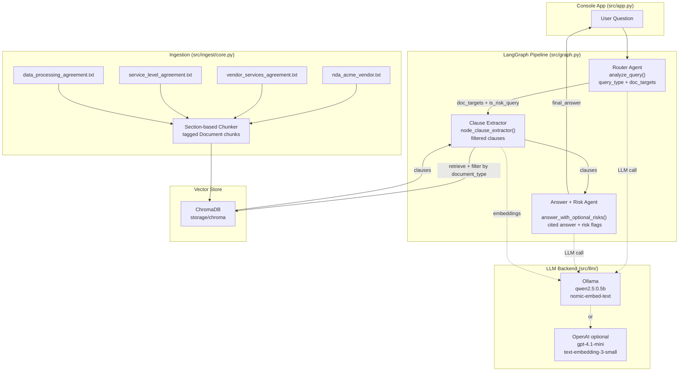

## Legal Multi‑Agent RAG for Contract Analysis

Interactive multi‑agent Retrieval‑Augmented Generation (RAG) system that helps users query and analyze a small corpus of legal contracts (NDA, Vendor Services Agreement, SLA, DPA).
The system runs as a console app and returns grounded answers with clause‑level citations and risk flags.

---

## 1. Problem overview

The goal is to assist a legal/BD user at Acme Corp in understanding and stress‑testing a vendor contract package.
Given natural‑language questions (e.g. *"What is the uptime commitment?"*, *"Which law governs the DPA?"*, *"Are there conflicting governing laws?"*), the system should:

- **Ingest** the provided contracts in `problem-statement/data/*.txt`
- **Retrieve** the most relevant clauses across all agreements
- **Analyze** them via specialized agents
- **Respond** with:
  - A concise natural‑language answer
  - Explicit clause citations
  - Highlighted legal / financial risks where applicable

The app is intentionally console‑based and multi‑turn to keep the focus on RAG design and agent orchestration rather than UI.

---

## 2. Architecture overview

### Architecture diagram



- **Tech stack**
  - Python 3.10
  - LangChain / LangGraph
  - Ollama (primary backend; open source, free, low latency)
  - OpenAI (optional backend for comparison)
  - ChromaDB vector store

- **Key modules**
  - `src/app.py` – CLI loop and conversation lifecycle
  - `src/graph.py` – LangGraph definition (3‑node pipeline)
  - `src/agents/core.py` – router prompt + answer/risk prompt
  - `src/ingest/core.py` – document loading and section‑based chunking
  - `src/retrieval/vectorstore.py` – vector store build/load helpers
  - `src/llm/factory.py` – LLM and embedding factory (Ollama or OpenAI)
  - `src/config.py` – configuration (paths, models, retrieval parameters)

### 2.1 Three‑node LangGraph pipeline

The system uses a simple, linear **LangGraph** with three nodes:

```text
router → clause_extractor → answer_and_risk → END
```

- **Router** – `node_router`
  - Calls `analyze_query` which asks the LLM to classify the question and return:
    - `query_type` ∈ `{fact_lookup, cross_agreement_compare, risk_summary, other}`
    - `doc_targets` ∈ `{nda, vendor_services, service_level, dpa, all}`
  - Maps `doc_targets` to concrete filenames (e.g. `nda` → `nda_acme_vendor`).
  - Sets `is_risk_query = true` when `query_type == "risk_summary"`.

- **Clause Extractor** – `node_clause_extractor`
  - Builds or loads the ChromaDB vector store (auto‑builds on first run).
  - Retrieves top‑k clauses for the question.
  - Filters results to only the `document_type`s selected by the Router (or all documents for risk queries).
  - De‑duplicates by `(source, section_index)`.

- **Answer + Risk** – `node_answer_and_risk`
  - A single LLM call via `answer_with_optional_risks`.
  - Always produces:
    - A grounded answer with inline `[1], [2], …` references.
    - A `Citations used:` block listing `[n] filename.txt, section: <title>`.
  - When `is_risk_query` is true, also produces a `Risk flags:` section with severity‑tagged bullets.
  - When `is_risk_query` is false, no risk section is included.

---

## 3. RAG design and ingestion

### 3.1 Document corpus

The legal corpus lives in `problem-statement/data`:

- `nda_acme_vendor.txt`
- `vendor_services_agreement.txt`
- `service_level_agreement.txt`
- `data_processing_agreement.txt`

`src.config.DATA_DIR` points to this directory, and `load_raw_docs` recursively loads all `*.txt` files from there.

### 3.2 Chunking strategy (section‑based)

For legal text, fixed‑size token windows can split obligations mid‑clause.
Instead, this project uses **section‑based chunking** implemented in `simple_clause_chunk`:

- Splits on **structural headers**, treating each as the start of a new chunk:
  - Numbered headings: `"1. Scope of Services"`, `"3. Data Breach Notification"`, etc.
  - Markdown headings: `#`, `##`, `###` (supported for future documents).
  - Short ALL‑CAPS headings: `TERMINATION`, `GOVERNING LAW`, etc.
- Each chunk therefore corresponds roughly to a **single clause or section** and its explanatory text.
- Every `Document` chunk is tagged with:
  - `source` – original filename
  - `document_type` – filename stem (e.g. `data_processing_agreement`)
  - `section_index` – per‑document section number
  - `section_title` – human‑readable heading (e.g. `Term and Termination`)

### 3.3 Embedding and LLM models

- **Default (Ollama) backend**
  - **Embedding model**: `nomic-embed-text`
    - Open‑source, high‑quality embeddings suitable for dense legal text.
  - **LLM model**: `llama3.2:1b`
    - Meta's lightweight 1.24B‑parameter model; fits in low‑memory environments (~1.3 GB).
  - Both models are served locally via the Ollama container defined in `docker-compose.yml`.

- **Optional OpenAI backend**
  - **Embedding model**: `text-embedding-3-small`
  - **LLM model**: `gpt-4.1-mini`
  - You can switch backend by changing `MODEL_BACKEND` in `src/config.py` to `"openai"` or `"ollama"`.

### 3.4 Retrieval mechanism

- Vector store: **ChromaDB**
  - Stored under `storage/chroma` as configured in `INDEX_DIR`.
  - Automatically built on first run if not present (from the ingested chunks).
- Retrieval:
  - Uses `vs.as_retriever(search_kwargs={"k": RETRIEVAL_TOP_K})`.
  - Top‑k (default 8) chosen to balance recall across multiple contracts with prompt length.
  - Risk queries use `2 × top_k` for wider cross‑agreement recall.

---

## 4. Setup instructions

### 4.1 Prerequisites

- Python **3.10+**
- [Poetry](https://python-poetry.org/docs/#installation) (Python dependency manager)
- Docker & Docker Compose (for the Ollama container, if using the Ollama backend)

### 4.2 Install Poetry (version 2.0.1)

If you don't have Poetry installed yet:

```bash
curl -sSL https://install.python-poetry.org | python3 - --version 2.0.1
```

Verify it's available:

```bash
poetry --version
# Expected: Poetry (version 2.0.1)
```

### 4.3 Install project dependencies

From the project root:

```bash
poetry install
```

This creates an isolated virtual environment and installs all dependencies from `pyproject.toml`.

### 4.4 Backend setup

The project supports three LLM backends. Pick one and follow the steps below.

#### Option A: Ollama (default – local, open source)

Set `MODEL_BACKEND = "ollama"` in `src/config.py` (already the default).

**Step 1** – Start the Ollama Docker container:

```bash
docker compose up ollama -d
```

**Step 2** – Pull the required models inside the running container:

```bash
docker exec ollama ollama pull nomic-embed-text
docker exec ollama ollama pull llama3.2:1b
```

Wait for both pulls to complete. You can verify they're available with:

```bash
docker exec ollama ollama list
```

Models used: `llama3.2:1b` (chat) and `nomic-embed-text` (embeddings).

#### Option B: Gemini

Set `MODEL_BACKEND = "gemini"` in `src/config.py`.

Set your Gemini API key:

```bash
export GOOGLE_API_KEY="your-gemini-api-key"
```

No Docker required. Models used: `gemini-2.0-flash` (chat) and `models/text-embedding-004` (embeddings).

#### Option C: OpenAI

Set `MODEL_BACKEND = "openai"` in `src/config.py`.

Set your OpenAI API key:

```bash
export OPENAI_API_KEY="sk-..."
```

Models used: `gpt-4.1-mini` (chat) and `text-embedding-3-small` (embeddings).

### 4.5 LangSmith tracing (optional)

[LangSmith](https://smith.langchain.com/) provides end-to-end tracing for every LangGraph run — latencies, token counts, prompts, and retrieved documents.

1. Create a free account at [smith.langchain.com](https://smith.langchain.com/) and generate an API key.
2. Add the key to your `.env` file (copy from `.env.example`):

```bash
cp .env.example .env
# then edit .env:
LANGCHAIN_API_KEY=lsv2_pt_...
LANGCHAIN_PROJECT=legal-multi-agent-rag   # optional, defaults to this value
```

The app automatically enables tracing when `LANGCHAIN_API_KEY` is present. If the key is missing, tracing is silently disabled and the app works normally.

---

## 5. Running the console app

From the project root (with the virtualenv activated):

```bash
poetry run python -m src.app
```

You should see:

```text
Legal Multi-Agent RAG CLI
Type your question about the contracts, or /quit to exit.
```

Then you can ask questions such as:

- "What is the notice period for terminating the NDA?"
- "What is the uptime commitment in the SLA?"
- "Which law governs the Vendor Services Agreement?"
- "Do confidentiality obligations survive termination of the NDA?"
- "Which agreement governs data breach notification timelines?"
- "Are there conflicting governing laws across agreements?"
- "Are there any legal risks related to liability exposure?"

For each query, the system will:

- Maintain conversation history across turns.
- Route to the relevant agreement(s).
- Retrieve and filter relevant clauses.
- Print a grounded answer with clause‑level citations.
- Include risk flags when the question is about risk or exposure.

---

## 6. Design choices & trade‑offs

- **Simple 3‑node pipeline vs. many specialized agents**
  - Chosen: Router → Clause Extractor → Answer+Risk (single LLM call).
  - Trade‑off: fewer moving parts, easier to debug, while still separating routing from retrieval from generation.

- **Section‑based chunking vs. fixed token windows**
  - Chosen: section / header‑based chunking.
  - Benefits: avoids splitting obligations mid‑clause; improves interpretability and citation quality.
  - Trade‑off: sections can be uneven in length, but the legal documents are relatively small, so this is acceptable.

- **Ollama (local, open‑source) vs. OpenAI**
  - Chosen: Ollama as the default for zero cost, low latency, and no external dependency.
  - Trade‑off: smaller model (qwen2.5:0.5b) may be less accurate on complex legal reasoning; OpenAI backend available as a fallback.

- **LLM‑based router vs. keyword heuristics**
  - Chosen: LLM router that returns `doc_targets` and `query_type`.
  - Benefits: handles ambiguous or novel phrasings better than static keyword rules.
  - Trade‑off: one additional LLM call per question, but it's a small/fast model and the call is lightweight.

- **Simple retrieval + metadata filtering vs. learned re‑ranker**
  - Chosen: base dense retrieval + deterministic filtering by `document_type`.
  - Trade‑off: no heavy re‑ranking or cross‑encoder cost; relies on good embeddings and prompts, which is adequate for this small corpus.

---

## 7. Evaluation approach

Basic evaluation is manual / scenario‑based, using the sample queries from the assignment:

- Coverage questions:
  - "What is the notice period for terminating the NDA?"
  - "What is the uptime commitment in the SLA?"
  - "Which law governs the Vendor Services Agreement?"
  - "Which agreement governs data breach notification timelines?"
- Risk and inconsistency questions:
  - "Are there conflicting governing laws across agreements?"
  - "Is liability capped for breach of confidentiality?"
  - "Is Vendor XYZ's liability capped for data breaches?"
  - "Are there any clauses that could pose financial risk to Acme Corp?"

For each query we check:

- **Grounding** – Are answers supported by the correct clauses?
- **Citation quality** – Do the referenced clauses `[1], [2], …` correspond to relevant sections?
- **Risk sensitivity** – Does the system flag key exposures (uncapped liability, conflicting laws, breach timelines) when asked?

Due to the small corpus size, a lightweight manual checklist is sufficient and easy to run end‑to‑end.

**Limitations of this evaluation**

- No automated metrics (e.g. retrieval‑hit rate, answer correctness scores).
- No large‑scale test set; focused on a curated handful of high‑signal questions.
- Human judgment required to mark answers as acceptable or not.

---

## 8. Known limitations & future work

- **Small, static corpus only**
  The system assumes a small set of text contracts in `problem-statement/data`. Handling PDFs at scale, versioning, or dynamic uploads would require an ingestion service.

- **No formal re‑ranking / calibration**
  Retrieval is dense + heuristic filtering; a cross‑encoder or reranker could improve robustness on edge cases.

- **Local LLM limitations**
  The default Ollama model (`llama3.2:1b`) is lightweight and fast but may struggle with complex multi‑hop reasoning or strict format adherence. Switching to Gemini or OpenAI is a one‑line config change.

- **Evaluation depth**
  Evaluation is qualitative and based on a handful of stress‑test queries; a production‑ready system would need a richer labeled set and automated checks.

Despite these trade‑offs, the current design demonstrates a clear, modular multi‑agent RAG architecture that is easy to extend and reason about for legal contract analysis.
